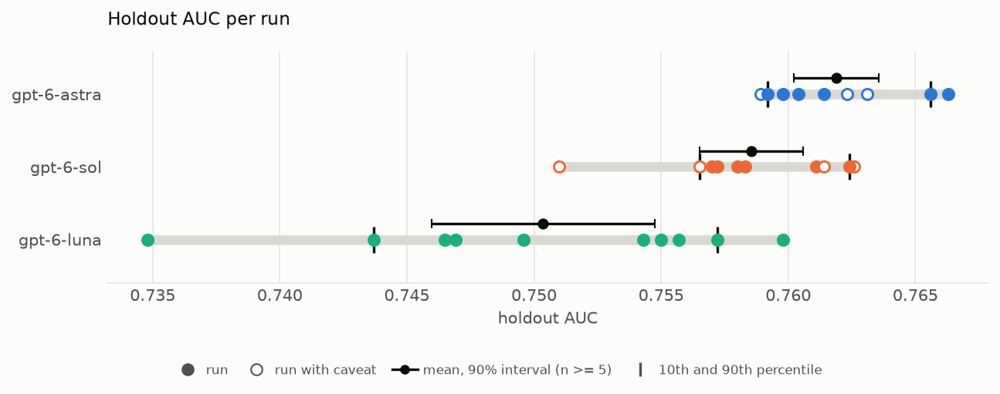
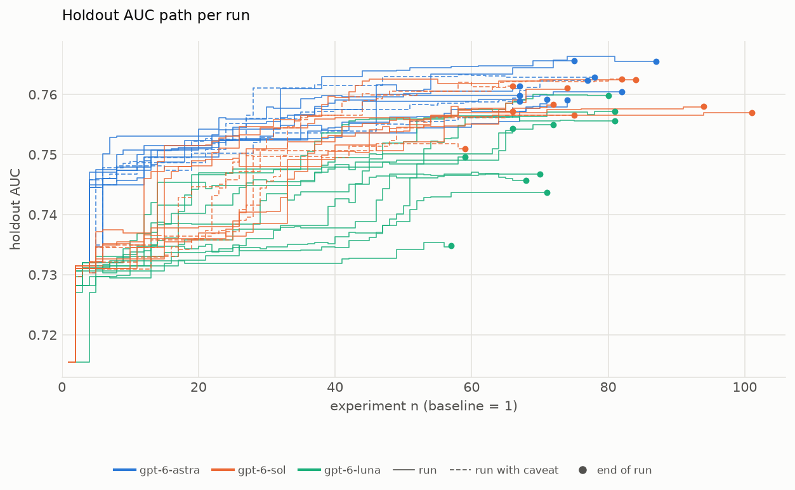

## One Run Is Not Enough: How Much AI Agent Results Vary  in Data Science, an XGBoost Optimization Study

#### by Szilard Pafka and Eduardo Ariño de la Rubia

**TL;DR** We had AI agents autonomously tune an XGBoost model 10 times each, using the same setup and the same instructions every time, and with three different LLMs. On average the agents deliver large improvements, and the LLMs rank clearly against each other. But the result of a single run varies a lot from run to run, and the ranges of the different LLMs overlap. One run of a given setup is not enough, either to judge how well an agent does or to compare agents.

---

In our [previous project](https://szilard.github.io/xgboost-autoresearch/) we showed that AI coding agents can automate much of a data scientist's trial-and-error work: they research ideas, engineer features, tune the hyperparameters of an XGBoost model, and keep what works. That was essentially one agent doing one run, though, and AI agents are not deterministic. Give the same agent the same task twice and it will try different ideas, in a different order, and end up with a different model. A single run is therefore an anecdote. It cannot tell us how good a setup really is, or whether one LLM is better than another. To answer those questions, we rebuilt the project into a minimal, self-contained building block that can be run many times, fully automatically.

The task is the same as before: predict whether a flight will be delayed, using airline data. The agent has 2 hours to improve a starter XGBoost model on its own. It searches the web for ideas, edits the code, keeps the changes that improve the score and discards the rest. Every model the agent keeps is then scored on a holdout dataset that the agent never sees, so we measure how well the models really generalize, not just the score the agent was optimizing. Compared to the first project, the setup ([xgboost-autoresearch-minimal2](https://github.com/szilard/xgboost-autoresearch-minimal2)) is simpler and stricter. The holdout data is cleanly separated, and automatic checks verify that the agent followed the rules. An orchestrator ([xgboost-autoresearch-minimal2-runs](https://github.com/szilard/xgboost-autoresearch-minimal2-runs)) runs the experiment repeatedly without any human steering: each run starts in a fresh, isolated environment, with identical instructions. With this, we ran three OpenAI models (gpt-6-luna, gpt-6-sol and gpt-6-astra), at maximum reasoning effort, 10 times each.

The first plot shows the final holdout AUC of each run (higher is better). Each dot is the best model of one 2-hour run, the grey bar spans the range of an LLM's runs, and the black dot with whiskers marks the mean with its 90% confidence interval. Every run improved substantially on the starter model, which scores 0.7155. On average the three LLMs rank clearly: astra comes first, then sol, then luna. But the runs of each LLM are spread widely. The gap between luna's best and worst run is about 0.025 AUC, more than half of the typical improvement the agents achieve over the starter model. The LLMs also differ in how consistent they are: sol's runs fall within about 0.012 of each other, half of luna's range. The ranges also overlap: luna's best run beats sol's worst run and is on par with astra's weaker runs. If we had compared the three LLMs based on a single run each, we could easily have ranked them wrong. (The hollow circles mark four sol runs in which the agent glanced at the data preparation script before reading the rules that forbid it; their results are in line with the other runs.) Reassuringly, in every run the holdout score closely tracks the score the agent was optimizing, so the improvements are real and not overfitting.

The second plot shows where this variation comes from. Each line traces one run, experiment by experiment, showing the holdout AUC of the best model the agent has kept so far, so each step up is a change the agent kept. Nearly all runs begin with the same obvious move, raising the number of trees from the starter's 30 to 100-300, which lifts the AUC to about 0.73. After that the paths diverge. Some runs find a key idea early and climb quickly, while others get stuck on a plateau for dozens of experiments. They also differ in pace: in the same 2 hours, runs completed anywhere between about 55 and 100 experiments. Part of the gap between the LLMs comes down to a single idea: every sol and astra run discovered that the exact calendar date of the flight is very informative (flights on the same day share weather and congestion), while no luna run used it. Luna's runs relied mostly on tuning hyperparameters; its best run did not add a single new feature. But a good idea alone does not guarantee a good result: sol's weakest run also used the date. How far a run gets therefore depends partly on luck: which ideas the agent happens to try, in what order, and how well it follows them up.

Our conclusion is that today's AI agents reliably deliver substantial improvements on a data science task like this one, but how large the improvement is varies a lot from run to run, even when the setup and instructions are identical. This has two practical consequences. First, to compare agents, LLMs, prompts or any other part of the setup, one run is not enough. You need repeated runs and should look at the distribution of the results, not a single number. Second, if you just want a good model, it pays to run the agent several times and pick the best run, judged on data the agent has not seen. Both repositories are open source, so you can use them to test your own agents, LLMs and setups, ideally with more than one run each.

License: [CC BY 4.0](https://github.com/szilard/xgboost-autoresearch2/blob/main/docs/LICENSE.md)

